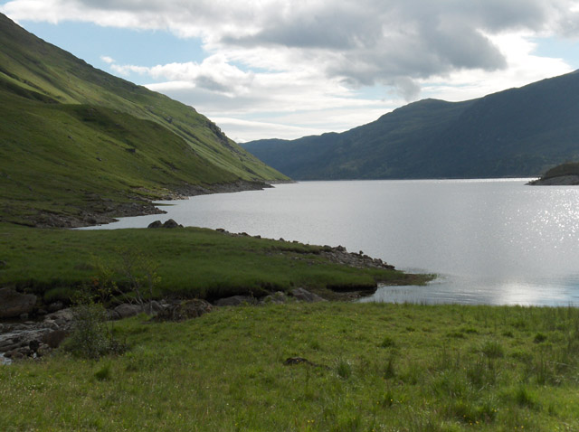

# Mullardoch

Experimental Python code for the Waveshare UGV02 robot.

## Lock Mullardoch
Mullardoch is a loch (major reservoir) in the Northwest Highlands of Scotland,
and is used as a collective project codename for my UGV02 software modules.

